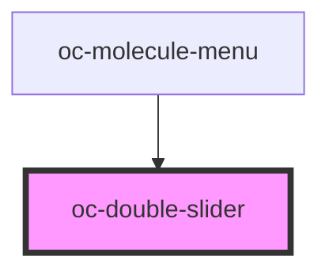

# oc-slider

<!-- Auto Generated Below -->

## Properties

| Property   | Attribute  | Description | Type               | Default     |
| ---------- | ---------- | ----------- | ------------------ | ----------- |
| `disabled` | `disabled` |             | `boolean`          | `false`     |
| `label`    | `label`    |             | `string`           | `undefined` |
| `max`      | `max`      |             | `number`           | `undefined` |
| `min`      | `min`      |             | `number`           | `undefined` |
| `step`     | `step`     |             | `number`           | `undefined` |
| `value`    | --         |             | `[number, number]` | `undefined` |

## Events

| Event      | Description | Type               |
| ---------- | ----------- | ------------------ |
| `ocChange` |             | `CustomEvent<any>` |

## Dependencies

### Used by

 - [oc-molecule-menu](../molecule-menu)

### Graph

----------------------------------------------

*Built with [StencilJS](https://stenciljs.com/)*
