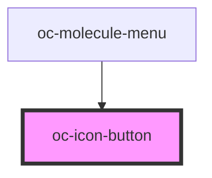

# oc-icon-button

<!-- Auto Generated Below -->

## Properties

| Property   | Attribute  | Description | Type      | Default     |
| ---------- | ---------- | ----------- | --------- | ----------- |
| `disabled` | `disabled` |             | `boolean` | `false`     |
| `icon`     | `icon`     |             | `any`     | `undefined` |

## Events

| Event      | Description | Type               |
| ---------- | ----------- | ------------------ |
| `ocChange` |             | `CustomEvent<any>` |

## Dependencies

### Used by

 - [oc-molecule-menu](../molecule-menu)

### Graph

----------------------------------------------

*Built with [StencilJS](https://stenciljs.com/)*
