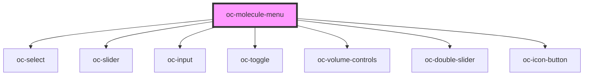

# oc-molecule-menu

<!-- Auto Generated Below -->

## Properties

| Property           | Attribute           | Description | Type                         | Default     |
| ------------------ | ------------------- | ----------- | ---------------------------- | ----------- |
| `activeMapName`    | `active-map-name`   |             | `string`                     | `undefined` |
| `animationScale`   | `animation-scale`   |             | `number`                     | `undefined` |
| `animationSpeed`   | `animation-speed`   |             | `number`                     | `undefined` |
| `colorMapNames`    | --                  |             | `string[]`                   | `undefined` |
| `colors`           | --                  |             | `[number, number, number][]` | `undefined` |
| `colorsX`          | --                  |             | `number[]`                   | `undefined` |
| `displayStyle`     | `display-style`     |             | `string`                     | `undefined` |
| `hasVolume`        | `has-volume`        |             | `boolean`                    | `undefined` |
| `histograms`       | --                  |             | `number[]`                   | `undefined` |
| `iMode`            | `i-mode`            |             | `number`                     | `undefined` |
| `iOrbital`         | `i-orbital`         |             | `number \| string`           | `undefined` |
| `isoValue`         | `iso-value`         |             | `number`                     | `undefined` |
| `mapRange`         | --                  |             | `[number, number]`           | `undefined` |
| `moleculeRenderer` | `molecule-renderer` |             | `string`                     | `undefined` |
| `nElectrons`       | `n-electrons`       |             | `number`                     | `undefined` |
| `nModes`           | `n-modes`           |             | `number`                     | `undefined` |
| `nOrbitals`        | `n-orbitals`        |             | `number`                     | `undefined` |
| `opacities`        | --                  |             | `number[]`                   | `undefined` |
| `opacitiesX`       | --                  |             | `number[]`                   | `undefined` |
| `orbitalSelect`    | `orbital-select`    |             | `boolean`                    | `undefined` |
| `orbitals`         | --                  |             | `IMolecularOrbitals`         | `undefined` |
| `play`             | `play`              |             | `boolean`                    | `undefined` |
| `range`            | --                  |             | `[number, number]`           | `undefined` |
| `scfType`          | `scf-type`          |             | `string`                     | `undefined` |
| `showIsoSurface`   | `show-iso-surface`  |             | `boolean`                    | `undefined` |
| `showVolume`       | `show-volume`       |             | `boolean`                    | `undefined` |
| `sphereScale`      | `sphere-scale`      |             | `number`                     | `undefined` |
| `stickRadius`      | `stick-radius`      |             | `number`                     | `undefined` |

## Events

| Event                     | Description | Type               |
| ------------------------- | ----------- | ------------------ |
| `activeMapNameChanged`    |             | `CustomEvent<any>` |
| `animationScaleChanged`   |             | `CustomEvent<any>` |
| `animationSpeedChanged`   |             | `CustomEvent<any>` |
| `displayStyleChanged`     |             | `CustomEvent<any>` |
| `iModeChanged`            |             | `CustomEvent<any>` |
| `iOrbitalChanged`         |             | `CustomEvent<any>` |
| `isoValueChanged`         |             | `CustomEvent<any>` |
| `mapRangeChanged`         |             | `CustomEvent<any>` |
| `moleculeRendererChanged` |             | `CustomEvent<any>` |
| `opacitiesChanged`        |             | `CustomEvent<any>` |
| `playChanged`             |             | `CustomEvent<any>` |
| `showIsoSurfaceChanged`   |             | `CustomEvent<any>` |
| `showVolumeChanged`       |             | `CustomEvent<any>` |
| `sphereScaleChanged`      |             | `CustomEvent<any>` |
| `stickRadiusChanged`      |             | `CustomEvent<any>` |

## Dependencies

### Depends on

- [oc-select](../select)
- [oc-slider](../slider)
- [oc-input](../input)
- [oc-toggle](../toggle)
- oc-volume-controls
- [oc-double-slider](../double-slider)
- [oc-icon-button](../icon-button)

### Graph

----------------------------------------------

*Built with [StencilJS](https://stenciljs.com/)*
