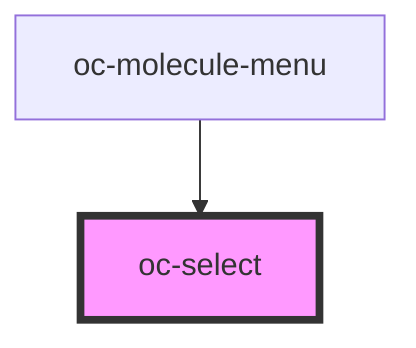

# oc-select

<!-- Auto Generated Below -->

## Properties

| Property  | Attribute | Description | Type             | Default     |
| --------- | --------- | ----------- | ---------------- | ----------- |
| `label`   | `label`   |             | `string`         | `undefined` |
| `options` | --        |             | `SelectOption[]` | `[]`        |
| `value`   | `value`   |             | `string`         | `undefined` |

## Events

| Event      | Description | Type               |
| ---------- | ----------- | ------------------ |
| `ocChange` |             | `CustomEvent<any>` |

## Dependencies

### Used by

 - [oc-molecule-menu](../molecule-menu)

### Graph

----------------------------------------------

*Built with [StencilJS](https://stenciljs.com/)*
