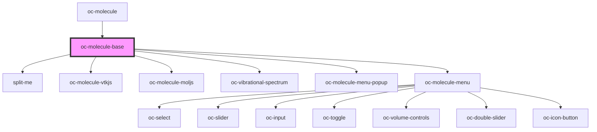

# oc-molecule-base

<!-- Auto Generated Below -->

## Properties

| Property           | Attribute           | Description | Type                         | Default     |
| ------------------ | ------------------- | ----------- | ---------------------------- | ----------- |
| `activeMapName`    | `active-map-name`   |             | `string`                     | `undefined` |
| `animationScale`   | `animation-scale`   |             | `number`                     | `undefined` |
| `animationSpeed`   | `animation-speed`   |             | `number`                     | `undefined` |
| `cjson`            | --                  |             | `IChemJson`                  | `undefined` |
| `colorMapNames`    | --                  |             | `string[]`                   | `[]`        |
| `colors`           | --                  |             | `[number, number, number][]` | `undefined` |
| `colorsX`          | --                  |             | `number[]`                   | `undefined` |
| `displayStyle`     | `display-style`     |             | `string`                     | `undefined` |
| `histograms`       | --                  |             | `number[]`                   | `undefined` |
| `iMode`            | `i-mode`            |             | `number`                     | `undefined` |
| `iOrbital`         | `i-orbital`         |             | `number \| string`           | `undefined` |
| `isoValue`         | `iso-value`         |             | `number`                     | `undefined` |
| `mapRange`         | --                  |             | `[number, number]`           | `undefined` |
| `moleculeRenderer` | `molecule-renderer` |             | `string`                     | `undefined` |
| `opacities`        | --                  |             | `number[]`                   | `undefined` |
| `opacitiesX`       | --                  |             | `number[]`                   | `undefined` |
| `orbitalSelect`    | `orbital-select`    |             | `boolean`                    | `undefined` |
| `play`             | `play`              |             | `boolean`                    | `undefined` |
| `range`            | --                  |             | `[number, number]`           | `undefined` |
| `rotate`           | `rotate`            |             | `boolean`                    | `undefined` |
| `showIsoSurface`   | `show-iso-surface`  |             | `boolean`                    | `undefined` |
| `showMenu`         | `show-menu`         |             | `boolean`                    | `undefined` |
| `showSpectrum`     | `show-spectrum`     |             | `boolean`                    | `undefined` |
| `showVolume`       | `show-volume`       |             | `boolean`                    | `undefined` |
| `sphereScale`      | `sphere-scale`      |             | `number`                     | `undefined` |
| `stickRadius`      | `stick-radius`      |             | `number`                     | `undefined` |
| `zoom`             | `zoom`              |             | `number`                     | `undefined` |

## Events

| Event                     | Description | Type               |
| ------------------------- | ----------- | ------------------ |
| `activeMapNameChanged`    |             | `CustomEvent<any>` |
| `animationScaleChanged`   |             | `CustomEvent<any>` |
| `animationSpeedChanged`   |             | `CustomEvent<any>` |
| `displayStyleChanged`     |             | `CustomEvent<any>` |
| `iModeChanged`            |             | `CustomEvent<any>` |
| `iOrbitalChanged`         |             | `CustomEvent<any>` |
| `isoValueChanged`         |             | `CustomEvent<any>` |
| `mapRangeChanged`         |             | `CustomEvent<any>` |
| `moleculeRendererChanged` |             | `CustomEvent<any>` |
| `opacitiesChanged`        |             | `CustomEvent<any>` |
| `playChanged`             |             | `CustomEvent<any>` |
| `showIsoSurfaceChanged`   |             | `CustomEvent<any>` |
| `showVolumeChanged`       |             | `CustomEvent<any>` |
| `sphereScaleChanged`      |             | `CustomEvent<any>` |
| `stickRadiusChanged`      |             | `CustomEvent<any>` |

## Dependencies

### Used by

 - [oc-molecule](.)

### Depends on

- split-me
- oc-molecule-vtkjs
- oc-molecule-moljs
- oc-vibrational-spectrum
- oc-molecule-menu-popup
- oc-molecule-menu

### Graph

----------------------------------------------

*Built with [StencilJS](https://stenciljs.com/)*
